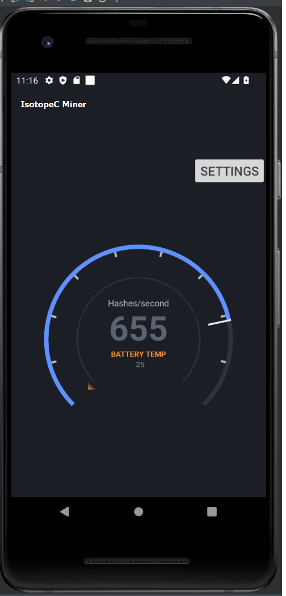
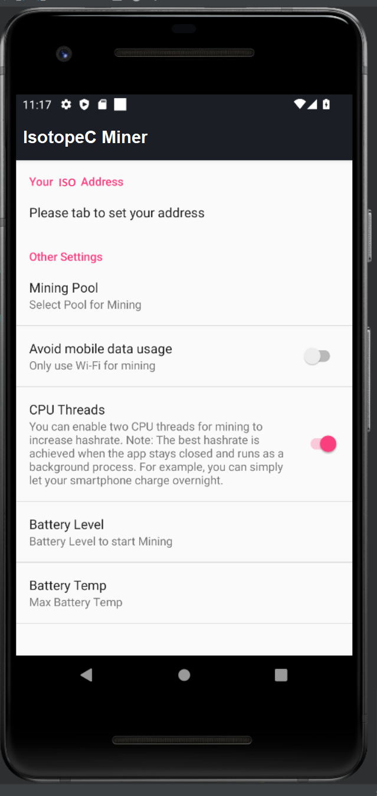
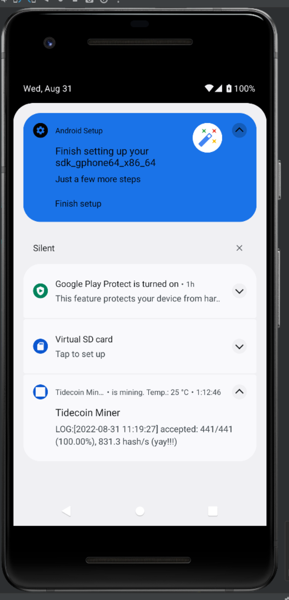

# IsotopeC-android-miner

## Start Mining
- Scan your ISO Address
- Choosing a mining pool. Still working on a specific pool configurd for the low hash rates of phones.
- Set battery level and maximum battery temperature.
- Set if you also like to mine with battery / mobile data.

## Autostart Mining
Your device will start mining automatically.
It doesn't matter if the app is open or not. You will find a status message in the status bar.
Note if you use half of threads for mining and screen is locked, your device might stop the service.
If you like to run a stable mining you should only use 25% of CPUs.

## Best Performance
For best performance, keep the display unlocked and app open in foreground.
Your device will then not fall into a "lazy" mode.

## Screens

